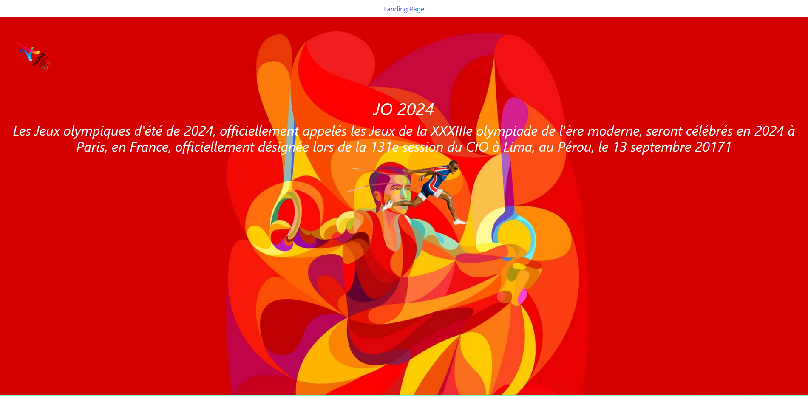
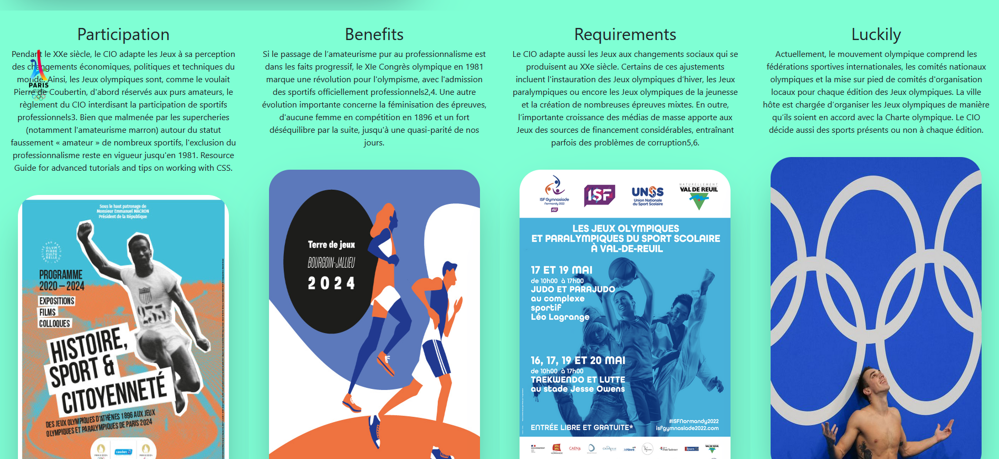

SCSS
=== 

Project effecue dans le cadre d'un ratrappage d'un cours de CSS dans le quelle en utilise du scss.

***Lien video Loom :  https://www.loom.com/share/3c9eb9cb7ae943a7925cf66c55a987f1

## Preview

## Prerequisites
Vous arez bezoin de [SCSS](https://https://sass-lang.com/) installé dans votr systeme.

## Setup

Get the code by either cloning this repository using git

    > git clone https://github.com/edsonDeCavalho/olympic-games-DE_CARVALHO-Edson_Kennedy/tree/main/olympic-games/CSS

... or [downloading source code](https://github.com/edsonDeCavalho/olympic-games-DE_CARVALHO-Edson_Kennedy/tree/main/olympic-games/CSS.zip) code as a zip archive.

Once downloaded, open the terminal in the project directory, and continue with:

### Customize configuration
See [Configuration Reference](https://cli.vuejs.org/config/).

